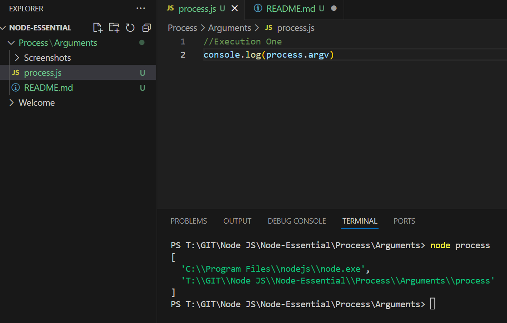
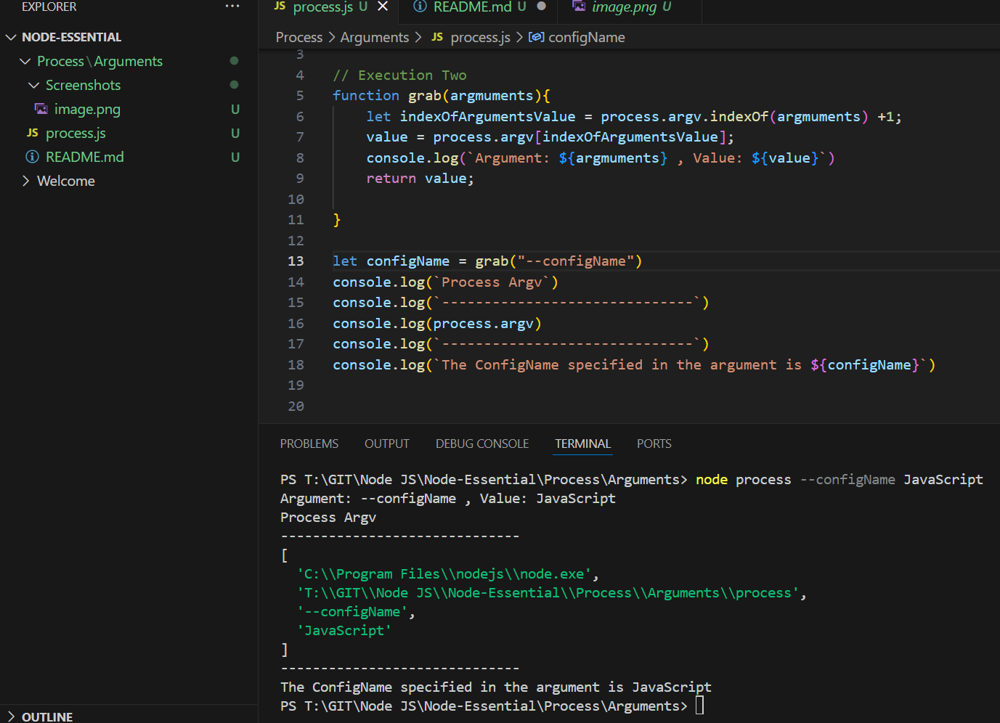

Execution One
```js
//Execution One
console.log(process.argv)
```
Otcome


Execution Two

```js
// Execution Two
function grab(argmuments){
    let indexOfArgumentsValue = process.argv.indexOf(argmuments) +1;
    let value = process.argv[indexOfArgumentsValue];
    console.log(`Argument: ${argmuments} , Value: ${value}`)
    return value;
   
}
```
Outcome
