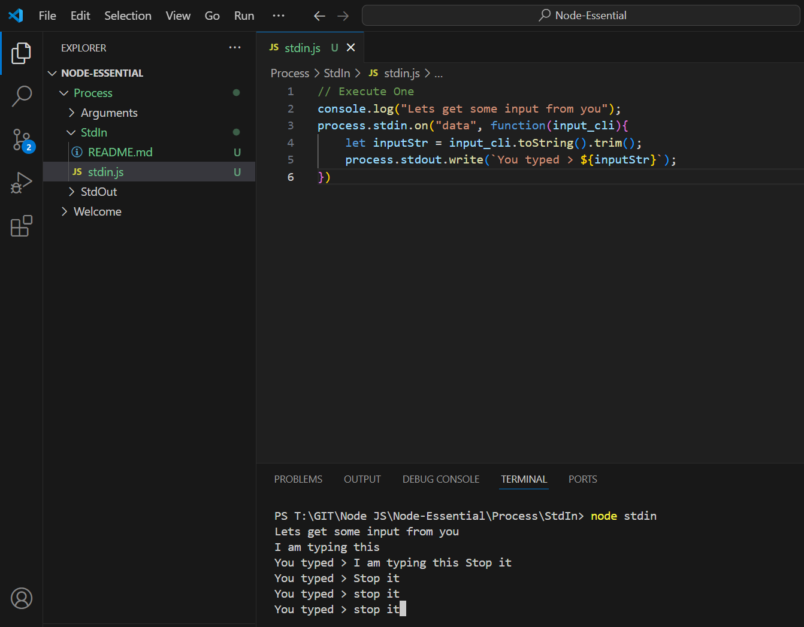
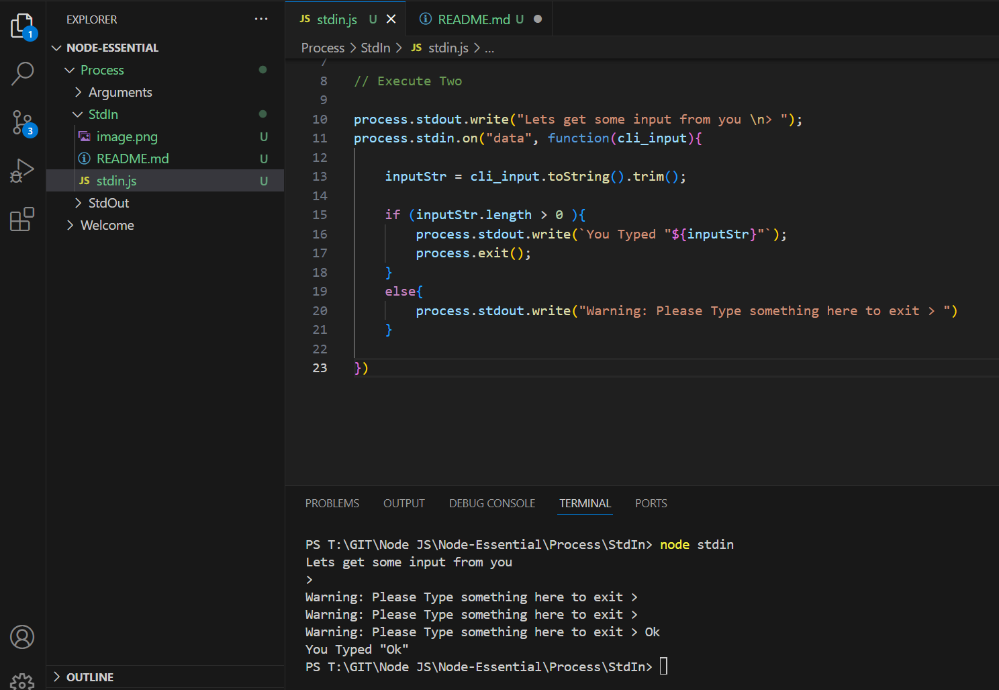

Execute one

```js
// Execute One
console.log("Lets get some input from you");
process.stdin.on("data", function(input_cli){
    let inputStr = input_cli.toString().trim();
    process.stdout.write(`You typed > ${inputStr}`);
})
```
Outcome



Execute Two

```js
process.stdout.write("Lets get some input from you \n> ");
process.stdin.on("data", function(cli_input){
    
    inputStr = cli_input.toString().trim();
    
    if (inputStr.length > 0 ){
        process.stdout.write(`You Typed "${inputStr}"`);
        process.exit();
    }
    else{
        process.stdout.write("Warning: Please Type something here to exit > ")
    }
        
})
```
Outcome


