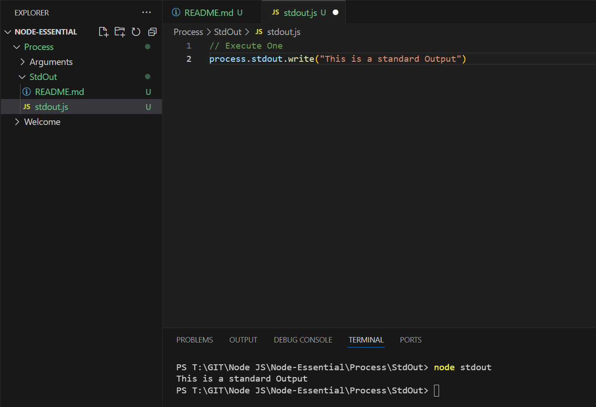
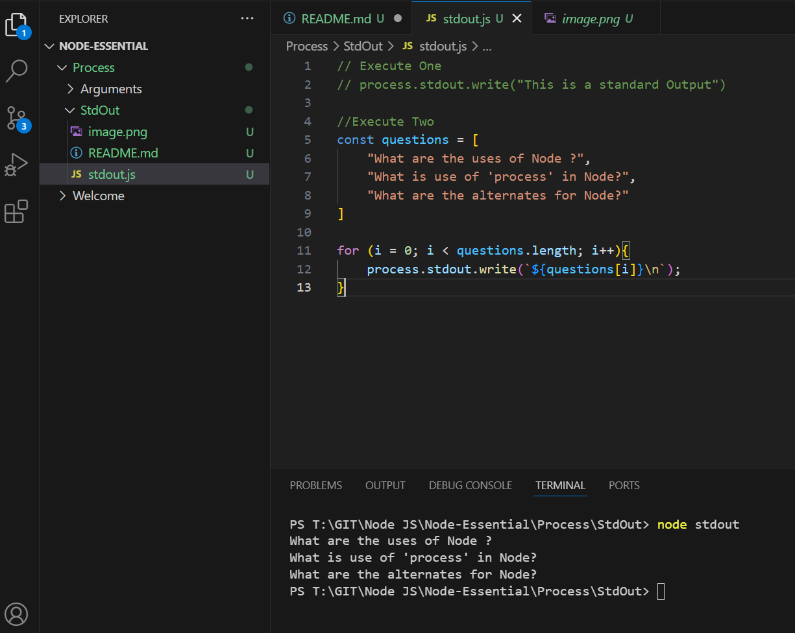

Execute One
```js
// Execute One
process.stdout.write("This is a standard Output")
```
Outcome


Execute Two

```js
//Execute Two
const questions = [
    "What are the uses of Node ?",
    "What is use of 'process' in Node?",
    "What are the alternates for Node?"
]

for (i = 0; i < questions.length; i++){
    process.stdout.write(`${questions[i]}\n`);
}
```

Outcome
