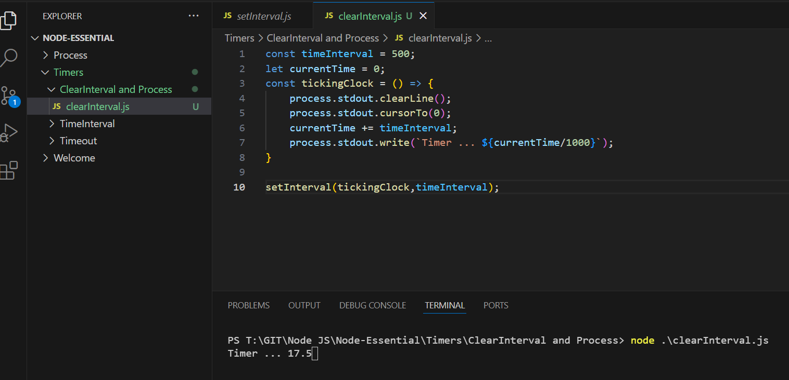

Execute 

```js
const timeInterval = 500;
let currentTime = 0;
const tickingClock = () => {
    process.stdout.clearLine();
    process.stdout.cursorTo(0);
    currentTime += timeInterval;
    process.stdout.write(`Timer ... ${currentTime/1000}`);
}

setInterval(tickingClock,timeInterval);
```

Outcome


