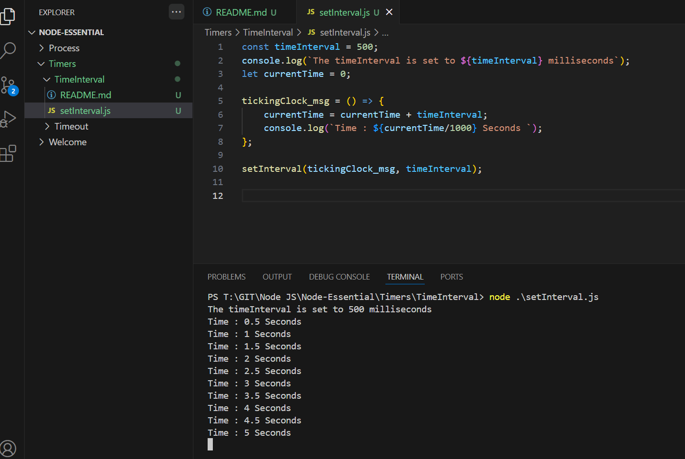

Execute

```js
const timeInterval = 500;
console.log(`The timeInterval is set to ${timeInterval} milliseconds`);
let currentTime = 0;

tickingClock_msg = () => {
    currentTime = currentTime + timeInterval;
    console.log(`Time : ${currentTime/1000} Seconds `);
};

setInterval(tickingClock_msg, timeInterval);
```

Outcome
