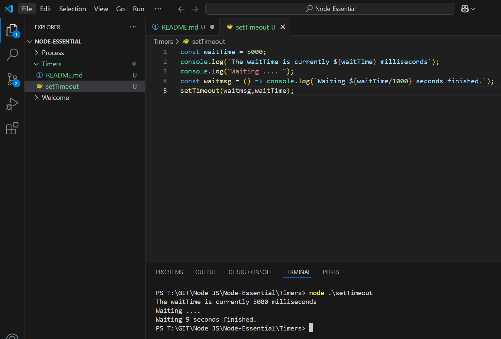

Execute

```js
const waitTime = 5000;
console.log(`The waitTime is currently ${waitTime} milliseconds`);
console.log("Waiting .... ");
const waitmsg = () => console.log(`Waiting ${waitTime/1000} seconds finished.`);
setTimeout(waitmsg,waitTime);

```

Outcome

