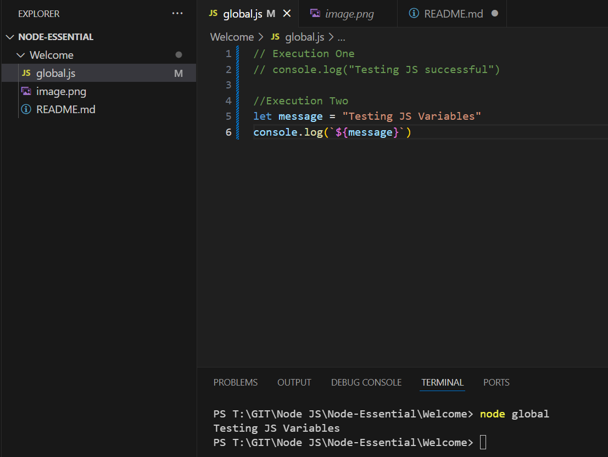
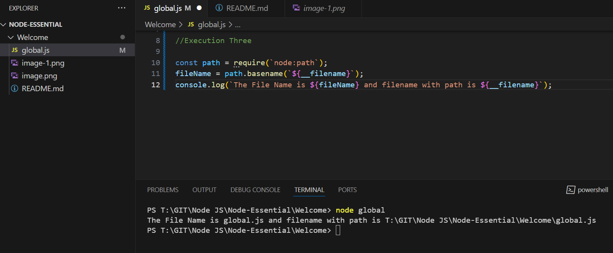

Execution One

```console.log("Testing JS successful")```

Outcome


Execution Two
```
//Execution Two
let message = "Testing JS Variables"
console.log(`${message}`) 
```

Outome


Execution Three

```
//Execution Three

const path = require(`node:path`);
fileName = path.basename(`${__filename}`);
console.log(`The File Name is ${fileName} and filename with path is ${__filename}`); 
```
Outcome
